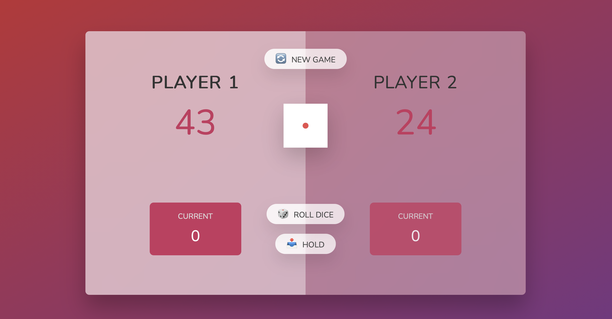
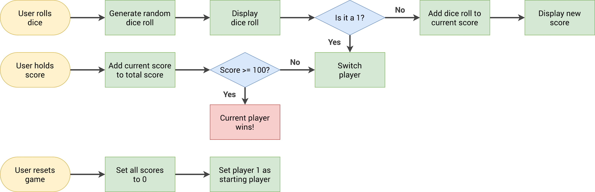

# dice-dash-hundred

A small browser game UI for the classic "Pig" dice game. This folder contains the UI, styles, and a starter script for rolling dice, holding scores, and switching players.

Preview

- Open [dice-dash-hundred/index.html](dice-dash-hundred/index.html) in your browser.

- Game Preview
  

- Flowchart
  

Files

- [dice-dash-hundred/index.html](dice-dash-hundred/index.html) — markup and game UI
- [dice-dash-hundred/style.css](dice-dash-hundred/style.css) — styles and layout
- [dice-dash-hundred/script.js](dice-dash-hundred/script.js) — game logic
- [dice-dash-hundred/assets/](dice-dash-hundred/assets/) — images/assets used by the UI

Run locally

- Quick: double-click [dice-dash-hundred/index.html](dice-dash-hundred/index.html)
- Serve via Python: `python3 -m http.server` then open http://localhost:8000/dice-dash-hundred/
- Serve via Node: `npx serve .` and navigate to the folder

Notes

- The game logic scaffold is in [dice-dash-hundred/script.js](dice-dash-hundred/script.js).
